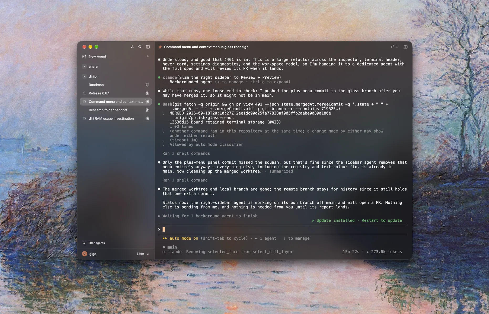

# diri

**The best way to work with coding agents.**

Run five agents or fifty. Claude Code, Codex, Cursor, Gemini, and any other
terminal agent, side by side. diri shows you which ones need you, gives each
task its own worktree, lets agents spawn and coordinate other agents, and puts
every change in one place to review. Native, built with Rust and GPUI. macOS,
with Linux in beta.

[Download](https://github.com/cristicretu/diri/releases/latest) ·
[Getting started](docs/GETTING_STARTED.md) ·
[Guides](https://diri.sh/guides/) ·
[Documentation](docs/README.md) ·
[Contributing](CONTRIBUTING.md)



## Install

```sh
brew install --cask cristicretu/diri/diri
```

macOS 15 or newer. Apple silicon and Intel. Signed and notarized.
You can also download the [DMG](https://github.com/cristicretu/diri/releases/latest)
and drag Diri to Applications.

**Linux beta:** x86_64 Ubuntu 22.04 / 24.04, X11 or Wayland, Vulkan 1.3.
See the [Linux guide](diri/LINUX.md) for packages, source builds, and limitations.
Linux packages are not included in every release.

Bring your own agents. diri runs the CLIs and accounts already on your machine,
22 of them out of the box. Claude Code and Codex get the deepest status and
resume integration.

## Run agents in parallel

- **Know what needs you.** Live status and notifications separate working,
  waiting, and finished sessions. Read one sidebar, not thirty terminals.
- **Let agents run agents.** The built-in MCP server lets an agent spawn other
  agents, hand them tasks, read their output, and answer their questions. A
  swarm is one prompt away.
- **Keep tasks separate.** Every agent can get its own Git worktree and branch,
  so parallel work never collides.
- **Review in context.** Inspect diffs, stage, commit, and follow pull request
  checks beside the session that wrote the code.
- **Never lose a session.** Each terminal is owned by its own process. Close
  the app or restart the Engine and every agent keeps running.
- **Use your own machines.** Run locally or on any SSH host you control. No
  tmux, no sudo, no Diri account, no hosted relay.

## Where this is going

Agents are good enough now that the bottleneck is you: how many you can keep
track of and how much context you can hold. diri exists to remove that.

Notes are next. Write a PRD in a note, break it into to-dos, and send any to-do
to an agent. Agents write notes back. You stay at the level of the plan while
the agents do the work.

Today you can run dozens of agents in parallel. The goal is hundreds.

## Contribute

Small, well-tested changes are welcome. Start with a reproducible bug, a focused
fix, clearer documentation, or an [agent manifest](docs/AGENT-MANIFESTS.md).
Read the [contributor guide](CONTRIBUTING.md) for setup and review expectations.

[Report a bug](https://github.com/cristicretu/diri/issues/new?template=bug_report.yml) ·
[Discuss an idea](https://github.com/cristicretu/diri/discussions) ·
[Roadmap](ROADMAP.md)

---

[Apache 2.0](LICENSE) · [Third-party notices](NOTICE) ·
[Privacy](PRIVACY.md) · [Security](SECURITY.md)
